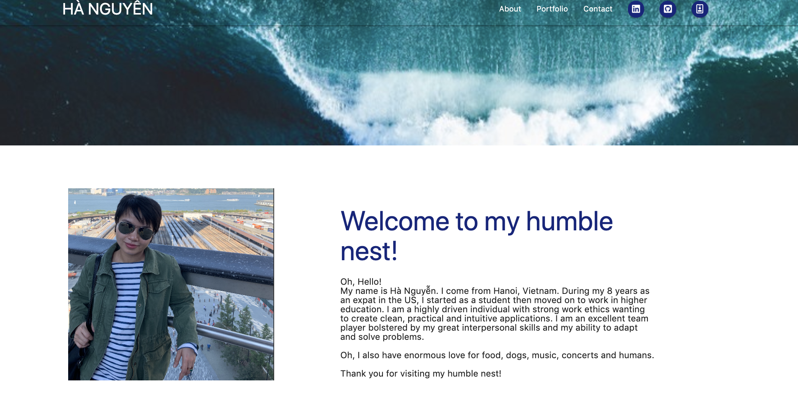
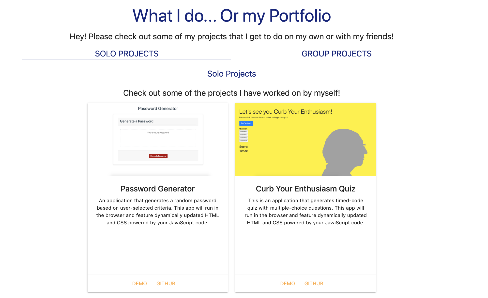

## About hanguyen.github.io
- This is a page about myself - Ha Nguyen. 
- It includes my contact, my experience, and all the projects I have individually and collaboratively worked on.
- It has links to my GitHub profile, LinkedIn, Facebook, Instagram, Twitter and Resume.

## Description: 

 
 
 

- The page is designed using Materialize CSS, fontawesome, JQuery and HTML5.
- The page will always be in on-going process, because I will keep on updating and adding new contents.
- This page is laptop, ipad, and phone friendly. 

## Feature:
- Materialize: https://materializecss.com/
- Font Awesome: https://fontawesome.com/start
- JQuery: https://jquery.com/download/

## Installation:
No installation needed.

## Question:
If you have any questions about the repo, please contact me at: https://github.com/iamha1/
